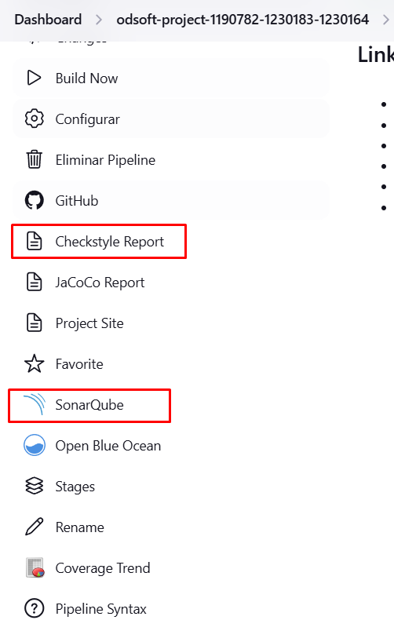
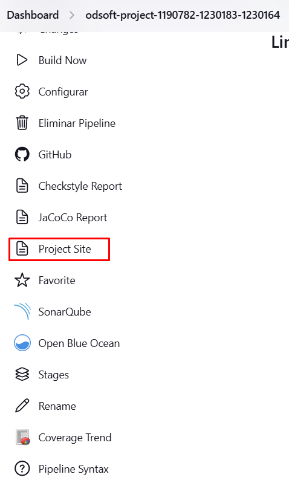

# ODSOFT Project 2024/2025 - CI/CD and Automated Testing

## Introduction
This project focuses on automating CI/CD and testing processes for a library management system. The system offers REST endpoints to manage information on books, genres, authors, readers, and loans. This project phase aims to improve the system's variability, configurability, reliability, and automation.

The main goals include implementing a CI/CD pipeline in Jenkins, covering build, packaging, code analysis, test execution, and deployment for local and remote environments. The project also explores advanced testing practices, including unit, integration, acceptance, and mutation testing, focusing on code coverage and reporting the results.

## Project Goals
1. **CI/CD Automation**  
   Configure and integrate Jenkins for a complete pipeline, including:
   - Version control (SCM)
   - Build and packaging (Build and Package)
   - Artifact generation
   - Static code analysis (e.g., SonarQube)

   In this section we will explain our thinking proccess and what we decided in order the results the team had.

2. **Automated Testing**
   - **Unit Tests**: Divided into black-box and white-box testing of domain classes.
   - **Mutation Testing**: Checking test effectiveness via mutation testing.
   - **Integration Tests**: Verifying interactions between controllers, services, and repositories.
   - **Acceptance Testing**: Validating expected system behavior.

3. **Performance and Documentation**
   - Document the system's initial state (design through reverse engineering).
   - Critically analyze the pipeline's performance over time, providing evidence of improvements.

## Project Structure
- **src/main/java**: Contains the system implementation.
- **src/test/java**: Contains unit, integration, and mutation tests.
- **Jenkinsfile**: Configuration file for the Jenkins CI/CD pipeline.
- **Documentation**: File detailing all the team decisions during the project.

## CI/CD Pipeline
A pipeline automates the software development process, ensuring code is consistently built, tested, and deployed. It integrates continuous integration (CI) and continuous delivery (CD) practices, reducing manual steps, catching bugs earlier. This leads to faster, more reliable deployments and higher code quality.

1. **Source Control Management (SCM)**  
   We started by implement the Source Control Management. This stage manages changes to source code over time. It keaps tracking of the code revision. It helps team collaboration by avoiding conflicts through branching and merging.
   It will mainly insure that the last code is built and tested automatically identifying issues earlier.
   For this step, we developed a stage that has the following command:

   ```groovy
    stage('SCM') {
            steps {
                checkout scm
            }
        }
   ```

   The checkout scm command will retrieve the source code from the version control system. In this case the team used Git. It will ensure that the pipeline is dealing with the last code version and everything is up to date.

2. **Build and Packaging**  
   In this tage, the team focused on compiling the source code and creating a deployable package. The build, has usual, will resolves dependencies, ensuring that the libraries and components are included in the final artifact. This step is one of the most importants because it will transform the source code into an application possible to be run. 
   The team implement a stage dedicated to building and packaging the application:

   ```groovy
    stage('Build and Packaging') {
        steps {
            script {
                if (isUnix()) {
                    sh 'mvn clean package'
                } else {
                    bat 'mvn clean package'
                }
            }
        }
    }
   ```

   The **mvn clean package** command invokes Maven which will first clean previous builds and then compiles the source code. This ensure that a fresh build is done everytime the pipeline is run.

3. **Static Code Analysis**  
    In this stage, we focused on guarantee the quality and maintainability of the code through the static analysis. This stage will check potential issues, such as code smells, bugs and vulnerabilites. With this step we can improve code quality.

    For this project, we implemented SonarQube and ScheckStyle as our static code analysis.

    ```groovy
    stage('Scan & Checkstyle') {
           parallel {
               stage('Scan') {
                   when { expression { !isUnix() } }  // Run this stage only on Windows
                   steps {
                       withSonarQubeEnv('sq-odsoft') {
                           withCredentials([string(credentialsId: 'sonar', variable: 'SONAR_TOKEN')]) {
                               bat "mvn org.sonarsource.scanner.maven:sonar-maven-plugin:3.9.1.2184:sonar -Dsonar.token=${SONAR_TOKEN} -Dsonar.java.binaries=target\\classes"
                           }
                       }
                   }
               }
               stage('Checkstyle') {
                   steps {
                       script {
                           if (isUnix()) {
                               sh 'mvn checkstyle:checkstyle -Dcheckstyle.failOnViolation=false'
                           } else {
                               bat 'mvn checkstyle:checkstyle -Dcheckstyle.failOnViolation=false'
                           }
                       }
                   }
               }
           }
       }
    ```

    We will discuss in another section why we decided to implement this two steps in parallel but for now we will give a brief explanation of what is happening in this stage.

    Sonarqube is the first detailed stage and is used for continuous inspection of code quality. It analyzes and provides detailed reports on multiple metrics, including code coverage, complexity, duplications, etc. 
    For this step we had to create in the jenkins a credential with the Id='sonar' and use it as a variable to the command to use. 
    The **mvn sonar:sonar** command uses the token and triggers the Sonar analysis. By analysing the compiled classes defined with the locatin _target/classes_ directory, SonarQube will initiathe the analysis and generate the reports.

    With the sonarqube, we implemented CheckStyle to guarantee coding standards and best practices. This tool will check the source code with a set of defined rules. This rules are defined in the checkstyle.xml file:

    

    We only defined one rule: LineLength. This is the only rule defined because the source code had a lot of problems. In order for us to confirm that CheckStyle was working properly, this rule was enough. We can see in the image that the max lenght value is set to 1000. This way, it won't return any error. If we set it to 500, for example, it will return 3 errors. With the usage of the flasgs failOnViolation=false, the pipeline always runs properly even if the Checkstyle detect some needed improvements. This way the user can check the report generated and see what problems must be solved but it won't block the pipeline.

    After this parallel stages we have the CheckStyle report publish:

    ```groovy
    stage('Publish Checkstyle Report') {
            steps {
                publishHTML([
                    reportDir: 'target/site',
                    reportFiles: 'checkstyle.html',
                    reportName: 'Checkstyle Report',
                    keepAll: true,
                    allowMissing: false,
                    alwaysLinkToLastBuild: true
                ])
            }
        }
    ```

    It will generate a checkstyle.html file in the specified directory: target/site.

    In jenkins we can see the SonarQube and CheckStyle report in the left panel of the pipeline run:

    
   
4. **Test Execution**  
    Testing is one of the most important parts of the pipelines. This stage will guarantee that new introduces features won't break the previous versions and will keep the code functional.

   1. **Unit Testing**: 

        Unit tests focus on validating components of the application individually, mainly domain classes. For this, in the pipeline we configured, in parallel, the run of the mutation, opaque and transparent tests. The reason why we decided to do it in parallel will be discussed in another section of this report.

        Mutation tests assess the effectiveness of the unit tests by introducing small changes to the codebase.

        ```groovy
        stage('Run Unit Tests') {
             parallel {
                 stage('Mutation Tests') {
                     steps {
                         script {
                             if (isUnix()) {
                                 sh 'mvn test -Dtest=pt.psoft.g1.psoftg1.unitTests.mutationTests.**.*Tests'
                             } else {
                                 bat 'mvn test -Dtest=pt.psoft.g1.psoftg1.unitTests.mutationTests.**.*Tests'
                             }
                         }
                     }
                 }
                 stage('Opaque and Transparent Tests') {
                     steps {
                         script {
                             if (isUnix()) {
                                 sh 'mvn test -Dtest=pt.psoft.g1.psoftg1.unitTests.opaqueAndTransparentTests.**.*Test'
                             } else {
                                 bat 'mvn test -Dtest=pt.psoft.g1.psoftg1.unitTests.opaqueAndTransparentTests.**.*Test'
                             }
                         }
                     }
                 }
             }
         }
        ```

        This parallel setup allows to run different unit tests categories concurrently, reducing the pipeline's runtime as will be demonstrated in another section.

    2. **Integration Tests**
        Integration tests guarant interaction between various component in the system, mainly controllers, services and repositories. The following stage will be reponsible for the integration tests run:

        ```groovy
        stage('Integration Testing') {
            parallel {
                stage('Controllers Testing') {
                    steps {
                        script {
                            if (isUnix()) {
                                sh 'mvn verify -Dtest=pt.psoft.g1.psoftg1.integrationTests.controllers.**.*Test -Dskip.unit.tests=true'
                            } else {
                                bat 'mvn verify -Dtest=pt.psoft.g1.psoftg1.integrationTests.controllers.**.*Test -Dskip.unit.tests=true'
                            }
                        }
                    }
                }
                stage('Services Testing') {
                    steps {
                        script {
                            if (isUnix()) {
                                sh 'mvn verify -Dtest=pt.psoft.g1.psoftg1.integrationTests.services.**.*Test -Dskip.unit.tests=true'
                            } else {
                                bat 'mvn verify -Dtest=pt.psoft.g1.psoftg1.integrationTests.services.**.*Test -Dskip.unit.tests=true'
                            }
                        }
                    }
                }
                stage('Repository Testing') {
                    steps {
                        script {
                            if (isUnix()) {
                                sh 'mvn verify -Dtest=pt.psoft.g1.psoftg1.integrationTests.repository.**.*Test -Dskip.unit.tests=true'
                            } else {
                                bat 'mvn verify -Dtest=pt.psoft.g1.psoftg1.integrationTests.repository.**.*Test -Dskip.unit.tests=true'
                            }
                        }
                    }
                }
            }
        }
        ```

        While running integration tests in parallel the pipeline gets optimized, reducing testing time as demonstrated also in another section.

    3. Coverage report
        Code coverage reports give visually details about the percentage of code tested. For this, we used JaCoCo to generate this report. 

        ```groovy
        stage('Publish JaCoCo Report') {
            steps {
                publishHTML([
                    reportDir: 'target/site/jacoco',
                    reportFiles: 'index.html',
                    reportName: 'JaCoCo Report',
                    keepAll: true,
                    allowMissing: false,
                    alwaysLinkToLastBuild: true
                ])
            }
        }
        ```

        It will generate a index.html file with the full report saving it in the directory _target/site/jacoco_.

5. **Report Results**
    This section is responsible for generating and publish comprehensive reports that provide insights about code qualit, testing coverage and many other metrics. The main goal is to create a detailed summary about the pipeline execution.

    1. The first part of this stage is the **mvn site** command that will generate a project site that includes various reports, for example unit test summaries, code analysis and documentation generated during the build execution. 

    ```groovy
    stage('Report Results') {
            steps {
                script {
                    if (isUnix()) {
                        sh 'mvn site'
                    } else {
                        bat 'mvn site'
                    }
                }
            }
        }
    ```

    2. After the site report generation, we used Jenkins publish html plugin to make these reports available in the left panel. 

    ```groovy
    stage('Publish Site Report') {
            steps {
                publishHTML([
                    reportDir: 'target/site',
                    reportFiles: 'index.html',
                    reportName: 'Project Site',
                    keepAll: true,
                    allowMissing: false,
                    alwaysLinkToLastBuild: true
                ])
            }
        }
    ```

    This will generate the index.html and move it to the _target/site_ directory. 

    

6. **Deployment**  
   The deployment stage guarantees that the latest application built is automatically transfered and made accessible in both local and remote environments.

    
    ```groovy
    stage('Deploy Local') {
            steps {
                script {
                    if (isUnix()) {
                        withCredentials([sshUserPrivateKey(credentialsId: 'TOKEN_SSH_ID', keyVariable: 'SSH_KEY')]) {
                            sh 'scp -o StrictHostKeyChecking=no -i $SSH_KEY target/psoft-g1-0.0.1-SNAPSHOT.jar root@vs1215.dei.isep.ipp.pt:/opt/myapp/psoft-g1/'
                        }
                    } else {
                        bat 'copy target\\psoft-g1-0.0.1-SNAPSHOT.jar C:\\deploy'
                    }
                }
            }
        }
    ```
    
   1. Local deployment 

    The .jar file generated in the build stage is copied to a specific directory. In this case it will copy the file to the _C:\\\deploy_ package. 

    2. Remote deployment to ISEP Server

    It will simulate a production environment in the remote server. The unix _scp_ command is used to securely transfer the .jar artifact to the specified remote directory on ISEP's server. 
    This command inclued an authentication token stored and managed by Jenkins. We had to configure this token as a credential in jenkins. By automating this step, the process is faster and more secure, with no manual intervention needed.

## Configurations and Tools Used

    During the pipeline, we had to differ from windows and linux system because the both systems don't use the same terminologies, for example bat (Windows) and sh (Linux) ensuring cross-platform compatibility.

- **Jenkins**: Automation of the CI/CD pipeline.
- **SonarQube**: Tool for static code analysis.
- **JaCoCo**: Tool for test coverage.
- **Postman**: Used for API testing and request verification.

## Technical Decisions and Justifications
- **Test Automation**: We chose to run tests in parallel to optimize the pipeline's runtime by separating unit and integration tests.
- **Deployment Environment**: Configured Jenkins to deploy both locally and remotely at ISEP, ensuring flexibility and redundancy.
- **Coverage and Quality**: Leveraged SonarQube for code quality checks to identify improvement areas.

## Results and Analysis
Below is a summary of test results and performance analysis observed during the project:

1. **Test Coverage**: JaCoCo reports indicated satisfactory code coverage, with an increase of X% due to integration and mutation testing.
2. **Code Quality**: SonarQube analysis highlighted improvements in code complexity and duplication.
3. **Pipeline Performance**: The pipeline runtime was optimized by X% throughout the project, reducing build and test parallel execution times.

## Conclusion
This project provided a comprehensive experience in automating development and testing processes using modern tools like Jenkins and SonarQube. Implementing a robust CI/CD pipeline and automated testing proved essential to ensure the library management system's reliability and scalability.

## Contributions
- Student Name 1 - Primary tasks and responsibilities
- Student Name 2 - Primary tasks and responsibilities
- Student Name 3 (optional) - Primary tasks and responsibilities

## References
- [Jenkins Documentation](https://www.jenkins.io/doc/)
- [SonarQube Documentation](https://docs.sonarqube.org/)
- [JaCoCo Documentation](https://www.eclemma.org/jacoco/trunk/doc/)

---

**Note**: For more details on the system execution and usage, please refer to the source code and included documentation files.
