# ODSOFT Project 2024/2025 - CI/CD and Automated Testing

## Introduction
This project focuses on automating CI/CD and testing processes for a library management system. The system offers REST endpoints to manage information on books, genres, authors, readers and loans. This project phase aims to improve the system's variability, configurability, reliability and automation.

The main goals include implementing a CI/CD pipeline in Jenkins, covering build, packaging, code analysis, test execution and deployment for local and remote environments. The project also explores advanced testing practices, including unit, integration, acceptance and mutation testing, focusing on code coverage and reporting the results.

## Quality Requirements (ASR)

ASR: It is an acronym for "Architecturally Significant Requirements". A subset of the non-functional quality requirements impinging directly on the architecture and structure of the system. These sets of requirements do not concern specific functionalities but rather essential features that guarantee the system is efficient, maintainable, and scalable over time. With regards to this library management system, ASRs include the following:

### Performance:

It should also be swift and efficient. For example, performance-related ASR ensures that the CI/CD pipeline finishes the whole process, which includes build and test, deployment in less than 5 minutes for quick feedback and a smooth workflow.

### Reliability:

The system should be robust and reliable. One target for reliability is having over 90% code coverage from testing. This reduces the chance of any bug reaching production. Static analysis, such as provided by SonarQube, is used to find and reduce potential problems in code, such as "code smells" and unnecessary complexity.

### Scalability:

The system should be in a position to support an increase in the number of users and data volumes without its current performance falling. It should be easily configurable and flexible enough to handle minor adjustments in view so that it can support additional modules and larger datasets with less extensive rewriting of code.

### Maintainability:

The code structure must support easy maintenance and upgrades. Tools like CheckStyle ensure that the code follows styling standards, enhancing readability and comprehension for other developers. This requirement also covers modularity and the use of coding best practices, allowing the system to be updated with minimal impact on other parts of the codebase.

### Documenting and Validating ASRs
To ensure the ASRs are met, the system includes reports and metrics in the CI/CD pipeline, with automated checks, such as:

### Test Coverage: Utilizing JaCoCo to generate coverage reports and ensure critical areas of the codebase are adequately tested.
#### Code Analysis:
Configuring SonarQube to perform checks for complexity, code duplication, and vulnerabilities, providing ongoing reports on code quality.
#### Pipeline Performance Metrics:
Assessing the execution time of different pipeline stages and adjusting them as needed to meet the under-5-minutes requirement.

In conclusion of this section, we can confirm that the system is not very well prepared to be on production since it has a lot of maintainability issues, low code coverage and a lot of problems detected with jacoco and sonarqube as it will be described below.

## Project Goals
1. **CI/CD Automation**  
   Configure and integrate Jenkins for a complete pipeline, including:
   - Version control (SCM)
   - SonarQube and CheckStyle
   - Build and packaging (Build and Package)
   - Tests Run
   - Jacoco
   - Deploy

   In this section we will explain our thinking proccess and what we decided in order the results the team had.

2. **Automated Testing**
   - **Unit Tests**: Divided into black-box and white-box testing of domain classes.
   - **Mutation Testing**: Checking test effectiveness via mutation testing.
   - **Integration Tests**: Verifying interactions between controllers, services and repositories.
   - **Acceptance Testing**: Validating expected system behavior.

3. **Performance and Documentation**
   - Document the system's initial state (design through reverse engineering).
   - Critically analyze the pipeline's performance over time, providing evidence of improvements.

## Project Structure
- **src/main/java**: Contains the system implementation.
- **src/test/java**: Contains unit, integration and mutation tests.
- **Jenkinsfile**: Configuration file for the Jenkins CI/CD pipeline.
- **Documentation**: File detailing all the team decisions during the project.

## CI/CD Pipeline
A pipeline automates the software development process, ensuring code is consistently built, tested and deployed. It integrates continuous integration (CI) and continuous delivery (CD) practices, reducing manual steps, catching bugs earlier. This leads to faster, more reliable deployments and higher code quality.

1. **Source Control Management (SCM)**  
   We started by implement the Source Control Management. This stage manages changes to source code over time. It keaps tracking of the code revision. It helps team collaboration by avoiding conflicts through branching and merging.
   It will mainly insure that the last code is built and tested automatically identifying issues earlier.
   For this step, we developed a stage that has the following command:

   ```groovy
    stage('SCM') {
            steps {
                checkout scm
            }
        }
   ```

   The checkout scm command will retrieve the source code from the version control system. In this case the team used Git. It will ensure that the pipeline is dealing with the last code version and everything is up to date.

2. **Build and Packaging**  
   In this tage, the team focused on compiling the source code and creating a deployable package. The build, has usual, will resolves dependencies, ensuring that the libraries and components are included in the final artifact. This step is one of the most importants because it will transform the source code into an application possible to be run. 
   The team implement a stage dedicated to building and packaging the application:

   ```groovy
    stage('Build and Packaging') {
        steps {
            script {
                if (isUnix()) {
                    sh 'mvn clean package'
                } else {
                    bat 'mvn clean package'
                }
            }
        }
    }
   ```

   The **mvn clean package** command invokes Maven which will first clean previous builds and then compiles the source code. This ensure that a fresh build is done everytime the pipeline is run.

3. **Static Code Analysis**  
    In this stage, we focused on guarantee the quality and maintainability of the code through the static analysis. This stage will check potential issues, such as code smells, bugs and vulnerabilites. With this step we can improve code quality.

    For this project, we implemented SonarQube and ScheckStyle as our static code analysis.

    ```groovy
    stage('Scan & Checkstyle') {
           parallel {
               stage('Scan') {
                   when { expression { !isUnix() } }  // Run this stage only on Windows
                   steps {
                       withSonarQubeEnv('sq-odsoft') {
                           withCredentials([string(credentialsId: 'sonar', variable: 'SONAR_TOKEN')]) {
                               bat "mvn org.sonarsource.scanner.maven:sonar-maven-plugin:3.9.1.2184:sonar -Dsonar.token=${SONAR_TOKEN} -Dsonar.java.binaries=target\\classes"
                           }
                       }
                   }
               }
               stage('Checkstyle') {
                   steps {
                       script {
                           if (isUnix()) {
                               sh 'mvn checkstyle:checkstyle -Dcheckstyle.failOnViolation=false'
                           } else {
                               bat 'mvn checkstyle:checkstyle -Dcheckstyle.failOnViolation=false'
                           }
                       }
                   }
               }
           }
       }
    ```

    We will discuss in another section why we decided to implement this two steps in parallel but for now we will give a brief explanation of what is happening in this stage.

    Sonarqube is the first detailed stage and is used for continuous inspection of code quality. It analyzes and provides detailed reports on multiple metrics, including code coverage, complexity, duplications, etc. 
    For this step we had to create in the jenkins a credential with the Id='sonar' and use it as a variable to the command to use. 
    The **mvn sonar:sonar** command uses the token and triggers the Sonar analysis. By analysing the compiled classes defined with the locatin _target/classes_ directory, SonarQube will initiathe the analysis and generate the reports.

    With the sonarqube, we implemented CheckStyle to guarantee coding standards and best practices. This tool will check the source code with a set of defined rules. This rules are defined in the checkstyle.xml file:

    

    We only defined one rule: LineLength. This is the only rule defined because the source code had a lot of problems. In order for us to confirm that CheckStyle was working properly, this rule was enough. We can see in the image that the max lenght value is set to 1000. This way, it won't return any error. If we set it to 500, for example, it will return 3 errors. With the usage of the flasgs failOnViolation=false, the pipeline always runs properly even if the Checkstyle detect some needed improvements. This way the user can check the report generated and see what problems must be solved but it won't block the pipeline.

    After this parallel stages we have the CheckStyle report publish:

    ```groovy
    stage('Publish Checkstyle Report') {
            steps {
                publishHTML([
                    reportDir: 'target/site',
                    reportFiles: 'checkstyle.html',
                    reportName: 'Checkstyle Report',
                    keepAll: true,
                    allowMissing: false,
                    alwaysLinkToLastBuild: true
                ])
            }
        }
    ```

    It will generate a checkstyle.html file in the specified directory: target/site.

    In jenkins we can see the SonarQube and CheckStyle report in the left panel of the pipeline run:

    
   
4. **Test Execution**  
    Testing is one of the most important parts of the pipelines. This stage will guarantee that new introduces features won't break the previous versions and will keep the code functional.

   1. **Unit Testing**: 

        Unit tests focus on validating components of the application individually, mainly domain classes. For this, in the pipeline we configured, in parallel, the run of the mutation, opaque and transparent tests. The reason why we decided to do it in parallel will be discussed in another section of this report.

        Mutation tests assess the effectiveness of the unit tests by introducing small changes to the codebase.

        ```groovy
        stage('Run Unit Tests') {
             parallel {
                 stage('Mutation Tests') {
                     steps {
                         script {
                             if (isUnix()) {
                                 sh 'mvn test -Dtest=pt.psoft.g1.psoftg1.unitTests.mutationTests.**.*Tests'
                             } else {
                                 bat 'mvn test -Dtest=pt.psoft.g1.psoftg1.unitTests.mutationTests.**.*Tests'
                             }
                         }
                     }
                 }
                 stage('Opaque and Transparent Tests') {
                     steps {
                         script {
                             if (isUnix()) {
                                 sh 'mvn test -Dtest=pt.psoft.g1.psoftg1.unitTests.opaqueAndTransparentTests.**.*Test'
                             } else {
                                 bat 'mvn test -Dtest=pt.psoft.g1.psoftg1.unitTests.opaqueAndTransparentTests.**.*Test'
                             }
                         }
                     }
                 }
             }
         }
        ```

        This parallel setup allows to run different unit tests categories concurrently, reducing the pipeline's runtime as will be demonstrated in another section.

    2. **Integration Tests**
        Integration tests guarant interaction between various component in the system, mainly controllers, services and repositories. The following stage will be reponsible for the integration tests run:

        ```groovy
        stage('Integration Testing') {
            parallel {
                stage('Controllers Testing') {
                    steps {
                        script {
                            if (isUnix()) {
                                sh 'mvn verify -Dtest=pt.psoft.g1.psoftg1.integrationTests.controllers.**.*Test -Dskip.unit.tests=true'
                            } else {
                                bat 'mvn verify -Dtest=pt.psoft.g1.psoftg1.integrationTests.controllers.**.*Test -Dskip.unit.tests=true'
                            }
                        }
                    }
                }
                stage('Services Testing') {
                    steps {
                        script {
                            if (isUnix()) {
                                sh 'mvn verify -Dtest=pt.psoft.g1.psoftg1.integrationTests.services.**.*Test -Dskip.unit.tests=true'
                            } else {
                                bat 'mvn verify -Dtest=pt.psoft.g1.psoftg1.integrationTests.services.**.*Test -Dskip.unit.tests=true'
                            }
                        }
                    }
                }
                stage('Repository Testing') {
                    steps {
                        script {
                            if (isUnix()) {
                                sh 'mvn verify -Dtest=pt.psoft.g1.psoftg1.integrationTests.repository.**.*Test -Dskip.unit.tests=true'
                            } else {
                                bat 'mvn verify -Dtest=pt.psoft.g1.psoftg1.integrationTests.repository.**.*Test -Dskip.unit.tests=true'
                            }
                        }
                    }
                }
            }
        }
        ```

        While running integration tests in parallel the pipeline gets optimized, reducing testing time as demonstrated also in another section.

    3. Coverage report
        Code coverage reports give visually details about the percentage of code tested. For this, we used JaCoCo to generate this report. 

        ```groovy
        stage('Publish JaCoCo Report') {
            steps {
                publishHTML([
                    reportDir: 'target/site/jacoco',
                    reportFiles: 'index.html',
                    reportName: 'JaCoCo Report',
                    keepAll: true,
                    allowMissing: false,
                    alwaysLinkToLastBuild: true
                ])
            }
        }
        ```

        It will generate a index.html file with the full report saving it in the directory _target/site/jacoco_.

5. **Report Results**
    This section is responsible for generating and publish comprehensive reports that provide insights about code qualit, testing coverage and many other metrics. The main goal is to create a detailed summary about the pipeline execution.

    1. The first part of this stage is the **mvn site** command that will generate a project site that includes various reports, for example unit test summaries, code analysis and documentation generated during the build execution. 

    ```groovy
    stage('Report Results') {
            steps {
                script {
                    if (isUnix()) {
                        sh 'mvn site'
                    } else {
                        bat 'mvn site'
                    }
                }
            }
        }
    ```

    2. After the site report generation, we used Jenkins publish html plugin to make these reports available in the left panel. 

    ```groovy
    stage('Publish Site Report') {
            steps {
                publishHTML([
                    reportDir: 'target/site',
                    reportFiles: 'index.html',
                    reportName: 'Project Site',
                    keepAll: true,
                    allowMissing: false,
                    alwaysLinkToLastBuild: true
                ])
            }
        }
    ```

    This will generate the index.html and move it to the _target/site_ directory. 

    

6. **Deployment**  
   The deployment stage guarantees that the latest application built is automatically transfered and made accessible in both local and remote environments.

    
    ```groovy
    stage('Deploy Local') {
            steps {
                script {
                    if (isUnix()) {
                        withCredentials([sshUserPrivateKey(credentialsId: 'TOKEN_SSH_ID', keyVariable: 'SSH_KEY')]) {
                            sh 'scp -o StrictHostKeyChecking=no -i $SSH_KEY target/psoft-g1-0.0.1-SNAPSHOT.jar root@vs1215.dei.isep.ipp.pt:/opt/myapp/psoft-g1/'
                        }
                    } else {
                        bat 'copy target\\psoft-g1-0.0.1-SNAPSHOT.jar C:\\deploy'
                    }
                }
            }
        }
    ```
    
   1. Local deployment 

    The .jar file generated in the build stage is copied to a specific directory. In this case it will copy the file to the _C:\\\deploy_ package. 

    2. Remote deployment to ISEP Server

    It will simulate a production environment in the remote server. The unix _scp_ command is used to securely transfer the .jar artifact to the specified remote directory on ISEP's server. 
    This command inclued an authentication token stored and managed by Jenkins. We had to configure this token as a credential in jenkins. By automating this step, the process is faster and more secure, with no manual intervention needed.

## Configurations and Tools Used

During the pipeline, we had to differ from windows and linux system because the both systems don't use the same terminologies, for example bat (Windows) and sh (Linux) ensuring cross-platform compatibility.

- **Jenkins**: Is a popular open-source automation server used for building, testing and deploying software projects. It enables continuous integration (CI) and continuous delivery (CD) by automating stages in the development lifecycle. Jenkins uses “pipelines” defined as code (usually in Jenkinsfile), which allows us to automate build, test, analysis and deployment tasks efficiently.
- **SonarQube**: Is a code quality analysis tool that evaluates code to identify potential bugs, vulnerabilities and code smells. It provides a continuous inspection of codebases, giving feedback on quality metrics just like complexity, duplications and code coverage. Using SonarQube in the pipeline, we can guarantee code meets high standards before deployment, helping to minimize potential issues and enforce best practices. SonarQube also integrates with Jenkins, automatically analyzing code each time it is committed and providing detailed reports on areas for improvement.
- **JaCoCo**: (Java Code Coverage) is a tool that measures code coverage by determining which lines of code are tested and which are not. It helps identify gaps in test cases by providing a comprehensive view of test coverage, which is critical for assessing the effectiveness of unit tests. Integrated into our Jenkins pipeline, JaCoCo generates reports each time tests are run, helping us maintain adequate coverage and guiding future test development for improved code reliability.

These tools combined create a robust and efficient CI/CD pipeline, providing a smooth process from code changes to automated deployment and verification, while ensuring high code quality and reliability.

## Technical Decisions and Justifications
- **Test Automation**: To optimize the pipeline's runtime and ensure rapid feedback, we configured the tests to run in parallel, categorizing them by unit tests and integration tests. By parallelizing these test stages, we reduced overall testing time and enhanced efficiency, enabling faster identification of issues at different levels of code integration and functionality. This approach minimizes bottlenecks, ensures timely detection of issues and maximizes resource utilization.
- **Deployment Environment**: Configured Jenkins to deploy both locally and remotely at ISEP Servers, ensuring flexibility and redundancy.
- **Coverage and Quality**: Integrating SonarQube for automated static code analysis, we ensured a consistent check on code quality, focusing on maintainability, complexity, duplication and potential vulnerabilities. This tool provided actionable insights for continuous improvement, allowing us to set and track quality standards with each commit. Additionally, using JaCoCo for coverage tracking offered a clear view of testing effectiveness, helping us to maintain high-quality code and prioritize additional testing where coverage was lacking.

## Results and Analysis
Below is a summary of test results and performance analysis observed during the project:

1. **Test Coverage**: JaCoCo reports indicated satisfactory code coverage, with an increase to 16% due to integration and unit testing. **Note** that this **is not** the final result because the report is being done at the same time as tests are being developed. The final number is supposed to be much higher.

These two reports were taken when we started the project.

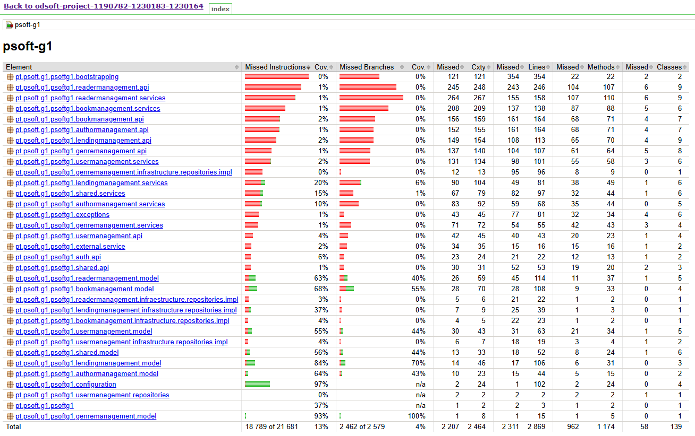

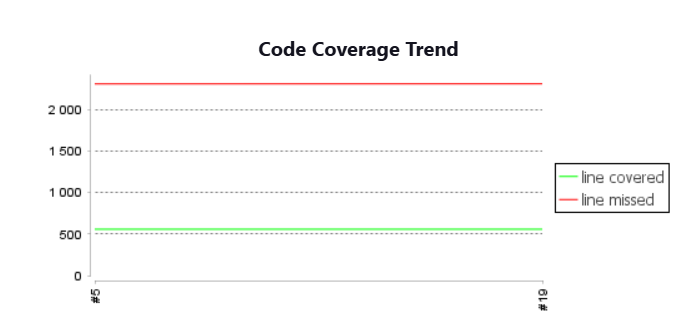

We can see that the Code Coverage Line is getting higher while the lines missed are decreasing:

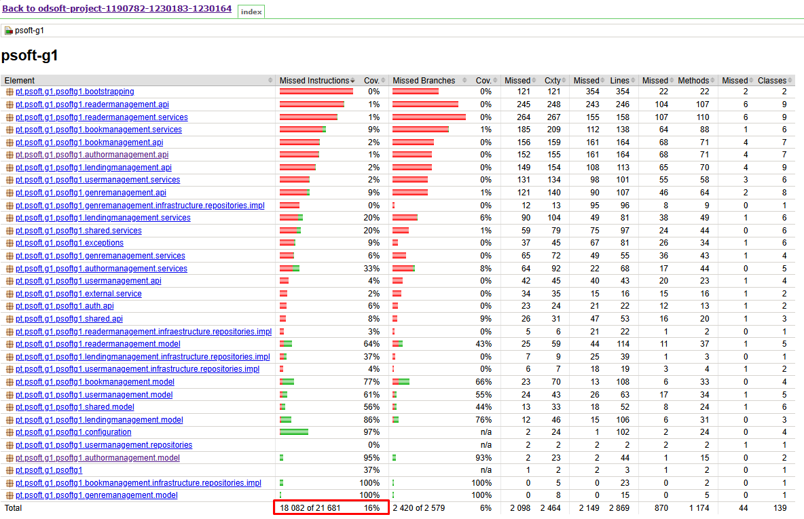
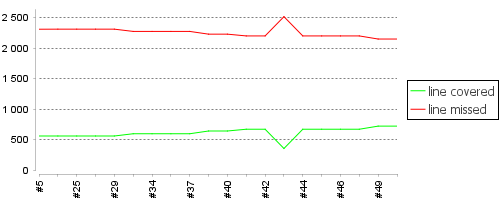
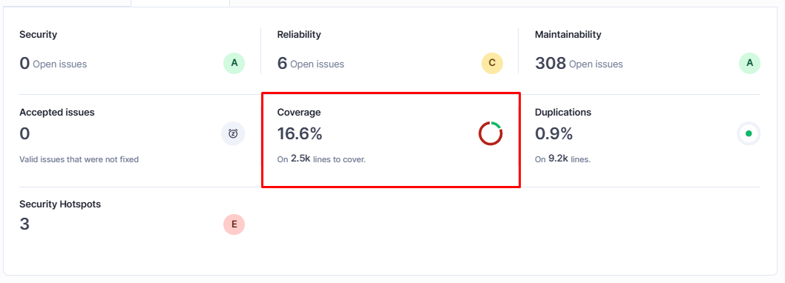

After improving and developing the tests, we can confirm that we improved the Code coverage by looking again at these both graphs.

2. **Code Quality**: SonarQube analysis highlighted improvements in code complexity and duplication.

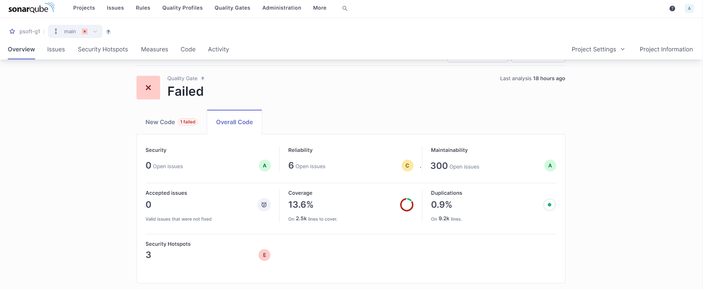

For example, if we open the maintainability warnings/erros we can find the following: 

1. 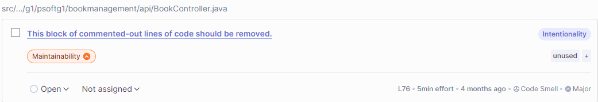

2. 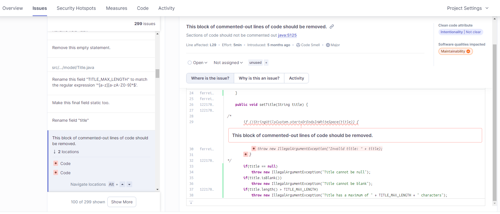

3. 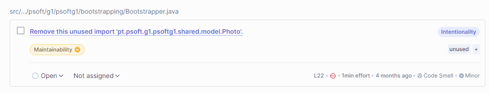

We solve this and more problems and now we can see that the maintainability dropped from 300 to 294 open issues. This confirms that the SonarQube is well prepared to analyze the code and new updates.


3. **Pipeline Performance**: The pipeline runtime was optimized by X% throughout the project, reducing build and test parallel execution times.

This was the time without using parallelism (4min 37s)

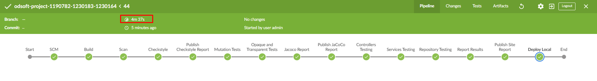
- Build : (48s)
- Scan : (29s)
- CheckStyle : (6s)
- Run Unit Tests : Mutation + Opaque and Transparent (38s)
- Integration Tests : (1m 27s)

First we tried to run the unit and integration tests in parallel, but the files for jacoco were still being used by integration.

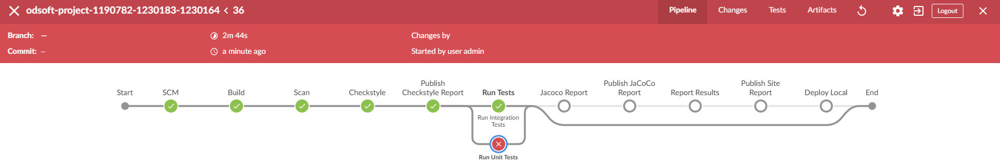

**Run Unit Test in parallel:**

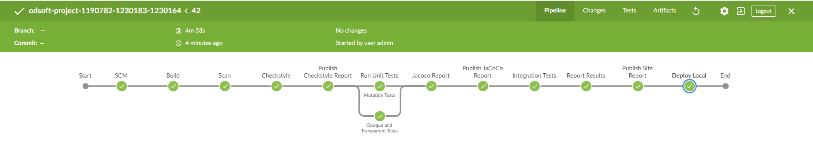
- Run Unit Tests : Mutation + Opaque and Transparent (25s)

With this we confirm that the Unit Tests are faster in parallel

**Run Integration Tests in parallel:**

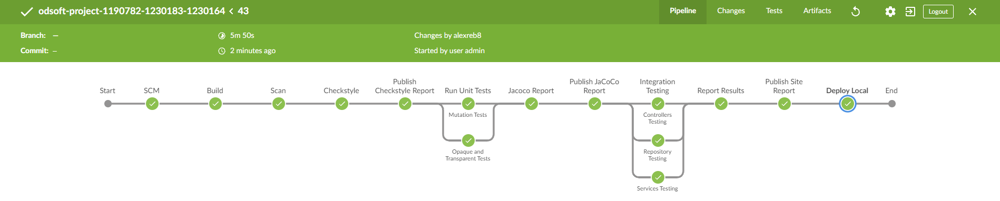

- Integration Tests : Controller + Service + Repo (1m 20s)

With this, we confirm that the integration tests are faster in parallel.

We run **scan and checkstyle** in parallel to get more performance and also because they are compatible with running in parallel.

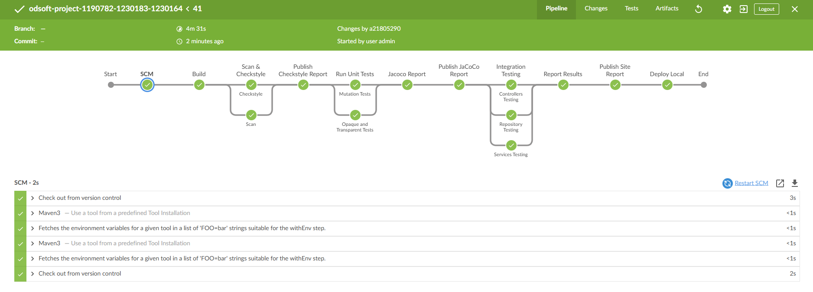

- Scan and Checkstyle : (31s)

The final time is 4m 31s. With this we can see that this is the best way we can use the pipeline.

## Conclusion
This project underscored the value of a better structured CI/CD process in organization of code quality, its efficiency and its reliability for the library management system. With the use of Jenkins, SonarQube, Checkstyle, and JaCoCo, we implemented an automated mechanism that made the processes of code examining and testing as well as code deployment easier.

The ability to conduct tests along with some static analysis concurrently was critical for the purposes of enhancing the execution times of the entire pipeline without compromising on the exhaustive coverage of validation. The use of SonarQube and Checkstyle further ensured best coding practices were adopted, as well as highlighting areas that need updates and improvement during the build process. JaCoCo offered valuable perspective on the level of test coverage achieved and assisted in identifying areas that needed more tests.

Deployment was automated for remote and local (on-site) environments in order to maintain uniformity between developments as well as productions which strengthened the faith taken upon the system’s reliability. Last but not least, this CI/CD pipeline ensured faster turnaround times whilst enhancing system visibility and control, which have set the stage for further advancement and future growth of the system.

## Contributions
- 1190782 - José Soares
- 1230164 - Alexandre Monteiro
- 1230183 - Fernando Castro